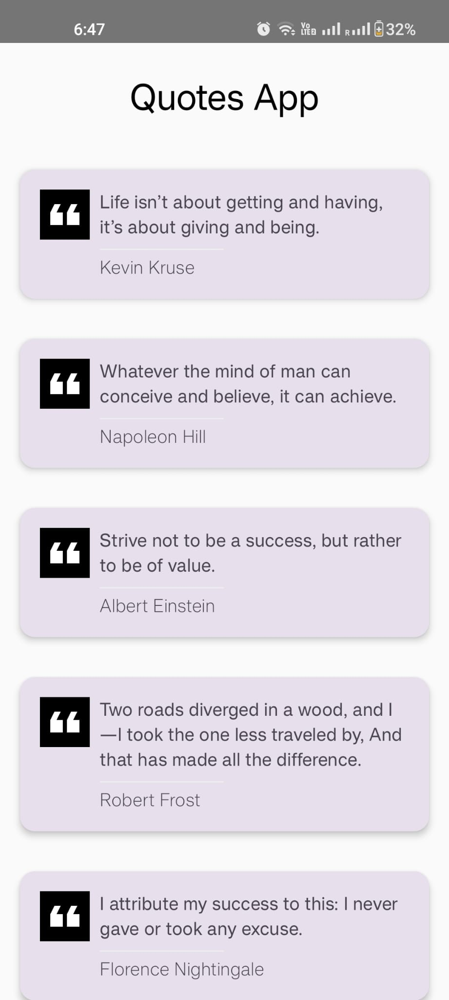
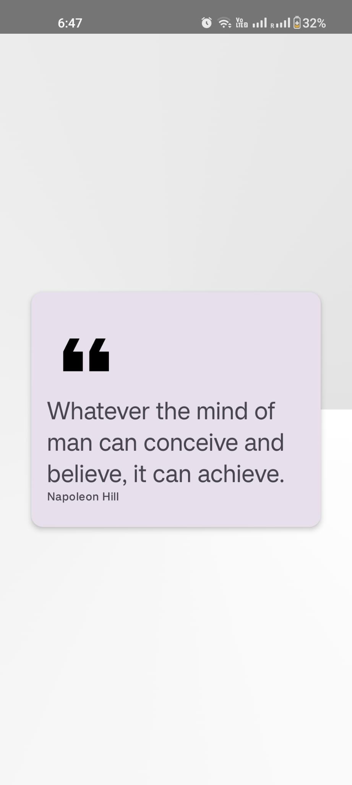

A simple Quotes app that displays some famous quotes and their authors.
The application has the following functionalities:

1) Followed Clean code and architecture principles.
2) Extracted JSON file into a mutable list using the Gson library.
3) UI purely built using Jetpack Compose.
4) State Hoisting is used to segregate Stateful and Stateless composable.
5) Navigation is done by the State Management concept.
6) Here are some of the screenshots.
   
 
